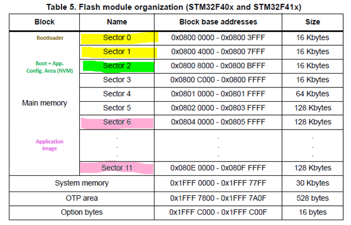
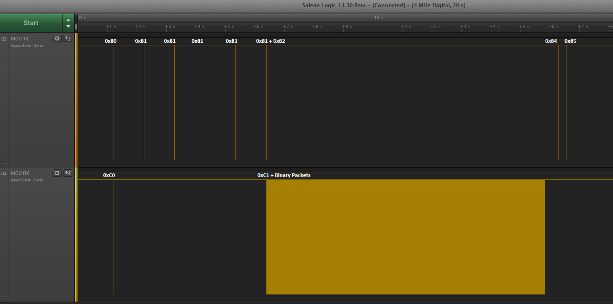
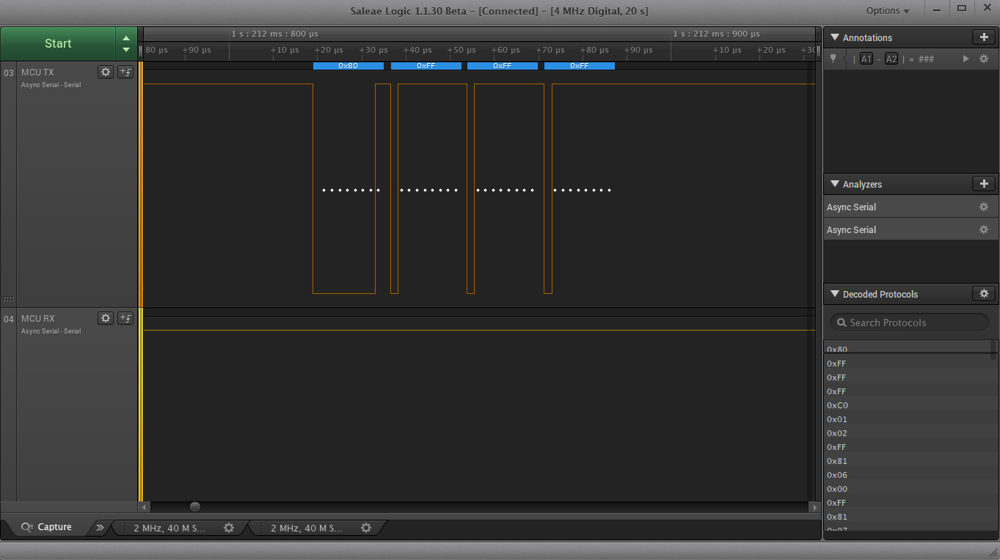
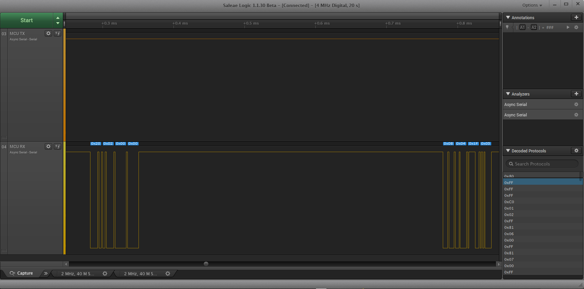
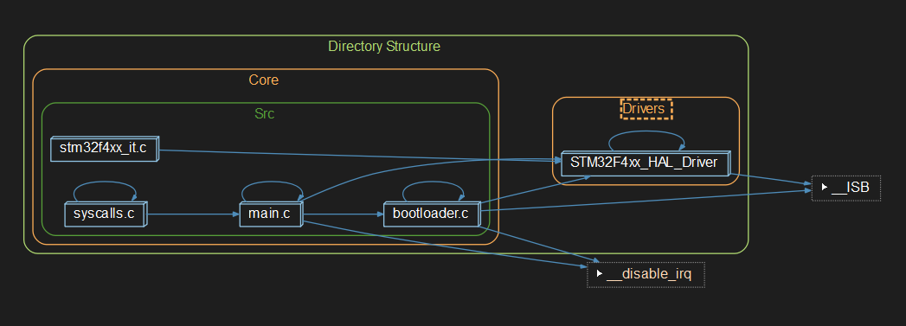
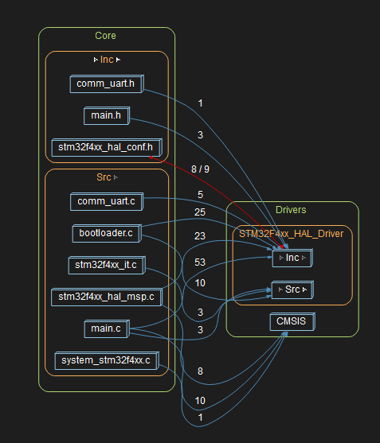
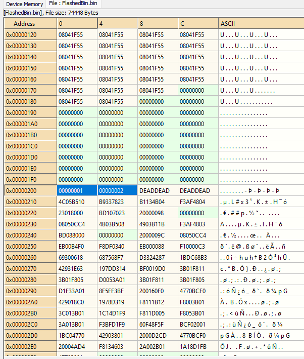

# STM32 Bootloader Project

This project consists in a **simple bootloader w/ flashing functionality.**

If the STM32 board is connected to the computer via the serial / UART interface (through a UART ->serial USB adapter), a new binary can be flashed by pressing the "Reset Button" of the board while running the **Python Flash Loader** (submodule inside **Python_STM32_Bootloader_Flasher** folder).

---
###  MCU Memory Layout:

The memory layout for this project is as follows:

**Bootloader Memory:**
-  Start Address: 0x0800 0000
- End Address:   0x0800 7FFF
- Size: 32KB 
- Sectors: 0+1

**Persistent Shared Config Memory:**
- Start Address: 0x0800 8000
- End Address:   0x0800 BFFF
- Size: 16KB 
- Sectors: 2

**Application Memory:**
- Start Address: 0x0804 0000
- End Address:   0x080F FFFF
- Size: 768KB
-Sectors: 6 to 11


---

**Memory Layout Table:**



--- 

### Flashing and Communication Protocol:

The protocol used for flashing new SW and checking for updates is a customized protocol created just for this project. The behavior is as follows: 

Whenever the MCU sends a command to the computer, it'll wait for 1000ms for an answer. If not answered, the MCU will throw and error and/or try to proceed to the application phase, depending on the state of the comunication.

**Start of communication + Receive SW version and size:**
1. **MCU:     0x80 FF FF FF** -> MCU will always send a 0x80 in the MSB after a reset or power-on takes place, indicating that the MCU is in the bootloader phase. Bytes 1,2,3 (LSB) values don't care.
2. **PC:      0xC0 mj mn FF** -> If the loader is running, PC will answer with a 0xC0 in the MSB (0x80 + 0x40), indicating that a serial communication is available and new SW might be flashed. The software MAJOR and MINOR version will be provided in bytes 1 and 2 respectively. Depending on the bootloader preprocessor directives, a repeated SW may be accepted or skipped.
3. **MCU:     0x81 xx yy FF** -> If new SW is accepted, the MCU starts to erase each memory sector. The sector being currently erased is displayed through bit 1. Byte 3 will turn from zero (0) to one (1) when all app. dedicated sectors were erased.
4. **PC:      0xC1 xx xx xx** -> After all app. dedicated sectors were erased, the PC will acknowledge with a 0xC1 in the MSB (0x81 + 0x40), indicating the number of packets that will be provided to flash the new SW binary in the bytes 1 to 3 (LSB).
5. **MCU:     0x82 xx xx xx** -> MCU confirms that it can receive the provided number packets (0x82). It'll also replicate / acknowledge the number of expected packets to be received in the bytes 1 to 3 (LSB).

**Start of communication - Error Codes / Skip Codes**
1. **MCU:     0x80 FF FF FF** -> PC receives a 0x80 in the MSB, indicating that a MCU is present in the bootloader phase. Bytes 1,2,3 (LSB) don't care.
2. **PC:      0xC0 mj mn FF** -> PC answers with a 0xC0 in the MSB (0x80 + 0x40), indicating that a serial communication is available and new SW might be flashed. The software MAJOR and MINOR version will be provided in bytes 1 and 2 respectively.
3. **MCU:     0x8E FF FF FF** -> MCU current software matches the current software to be flashed. Skipping flash procedure, jumping to application directly.

---
**Binary data streaming (loop - normal operation):**
1. **PC:      0xyy yy yy yy** -> PC sends the 4-byte package containing the SW binary contents.
**...**
*procedure repeated until all expected packets are sent.*

**Binary data streaming (loop - error operation):**
1. **PC:      0xyy yy yy yy** -> 4-byte package containing the SW binary.
2. **MCU:     0x8F FF FF FF** -> Error - MCU couldn't flash the last packet provided / generic error. Aborting flash.
---
**End of transmission**
1. **MCU:     0x84 00 xy zw** -> MCU informs that the transmission has been completed and returns the checksum (CRC16) of the whole flashed binary in bytes 2 and 3. The computer is responsible for checking the CRC plausibility.
---
**Jump to application**
1. **MCU:     0x85 FF FF FF** ->MCU informs bootloader routine is finished, application SW is to be started.

---
## Timing diagram of the process:

**Overview:**


**Example of 0x80 - MCU opening communication:**


**Example of binaries being tranmitted:**


---

## SW Architecture:

**Calls Graph:**


**Dependencies:**


---

## Expected layout of an Application Image:

**Requirement 1:** As per currently configured, an application image is expected to start in address **0x0804000**.

**Requirement 2:** An application binary is also expected to carry into its code the current *SW_Major* and *SW_Minor* version as *uint32_t* data objects into the binary addresses *0x200* and *0x204* respectively, as per the image below (Major = 1 and Minor = 2):




The applications used in conjunction with this bootloader have the following linker specifications (linker file **STM32xxx_FLASH.ld**) to match the upper requirements:

```C

/* ... linker file upstream Memories definition *** */

/* Memories definition */
MEMORY
{
CCMRAM    (xrw)    : ORIGIN = 0x10000000,   LENGTH = 64K
RAM    (xrw)    : ORIGIN = 0x20000000,   LENGTH = 128K
FLASH    (rx)    : ORIGIN = 0x8040000,   LENGTH = 512K /* Init. Address offset + adjusted length*/
}


/* ... linker file downstream Memories definition *** */

SECTIONS {
    /* ... sections upstream .config_data *** */
    
    .config_data : /* This memory sector is used for the binary file to carry SW related data (header) */
    {
        . = ORIGIN(FLASH) + 0x0200; /* SW config data initial address - Fixed address from memory start */
        KEEP(*(.config_data)) /* SW config data */
        . = ORIGIN(FLASH) + 0x0210; 
    } >FLASH
    
    /* ... sections downstream .config_data *** */
}
```


